**完整代码收费  加qq  931708230 或者加微信  ynwwxid**

**接毕业设计和论文**

**[博客地址](https://blog.csdn.net/2303_76227485/article/details/128649722)**

**视频演示：[视频演示地址](https://space.bilibili.com/384537280)**

**毕业设计所有选题地址：[https://github.com/ynwynw/allProject](https://github.com/ynwynw/allProject)**

## 基于springboot的个人博客系统 (源代码+数据库)

## 一、系统介绍

普通用户功能：

浏览博客文章，通过关键字搜索文章，通过标签搜索文章，可以看到最新发布的文章，和点击最多的博客排行，可以对文章进行评论。

后台功能：

普通用户：发布博客、修改密码、修改博客。

管理员用户：数据统计管理、发布博客、博客管理、评论管理、分类管理、标签管理、修改密码

## 二、所用技术

后端技术栈：

- SpringBoot+Mybatis+mysql

前端技术栈：

- Thymeleaf

## 三、环境介绍

基础环境 :IDEA/eclipse, JDK 1.8, Mysql5.7及以上,Maven

源码+数据库脚本

所有项目以及源代码本人均调试运行无问题 可支持远程调试运行

## 四、页面截图

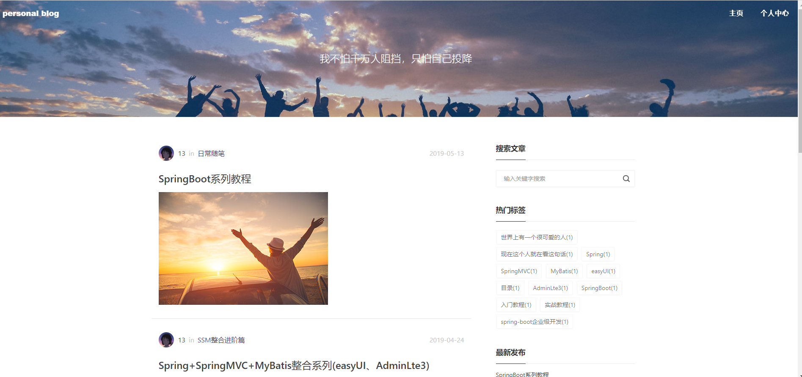

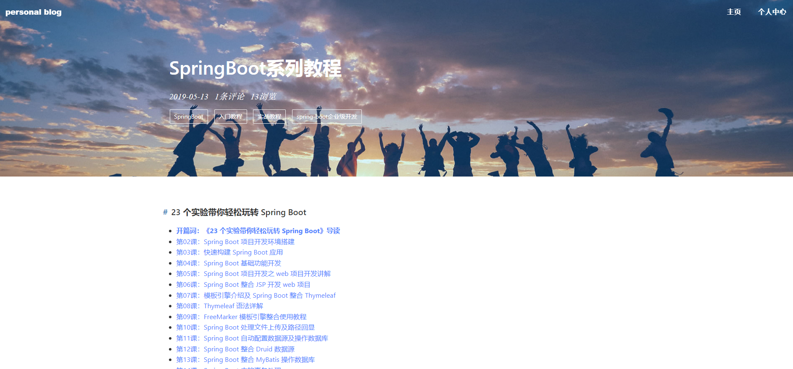

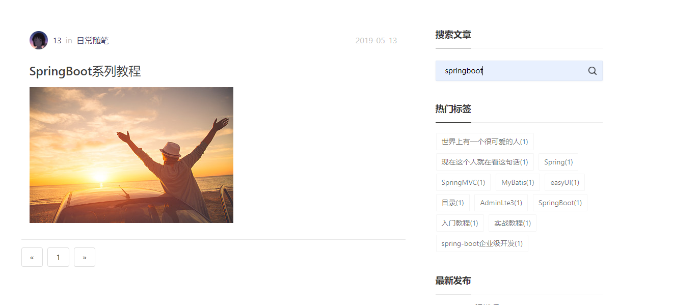

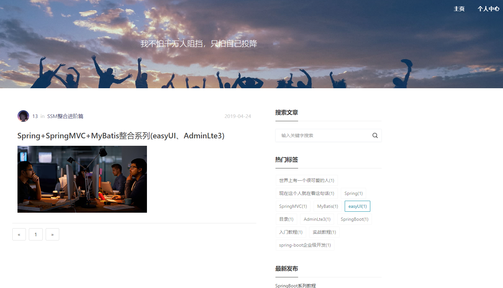

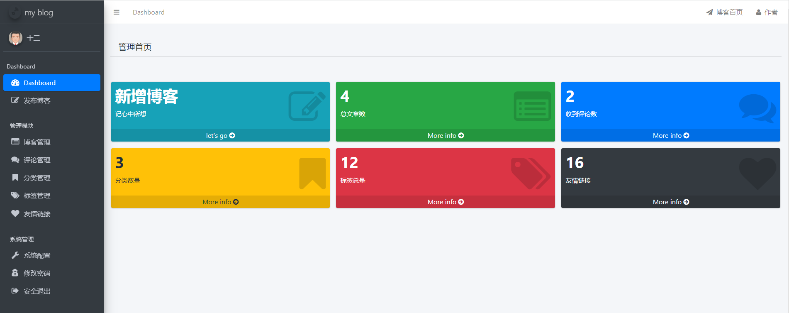

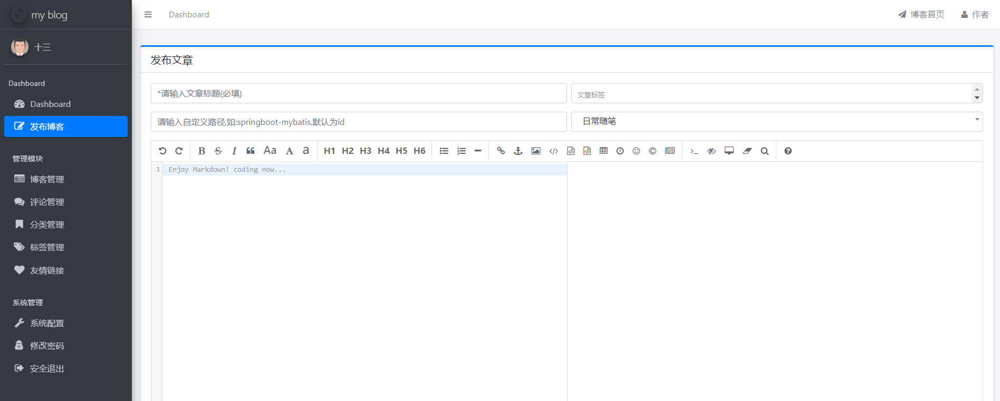

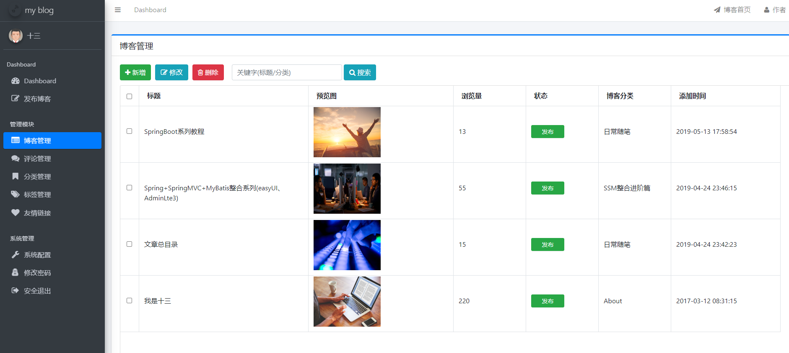

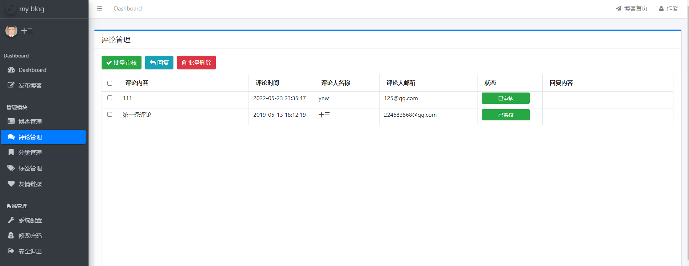

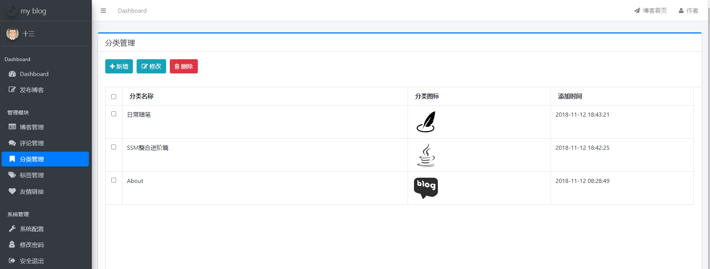

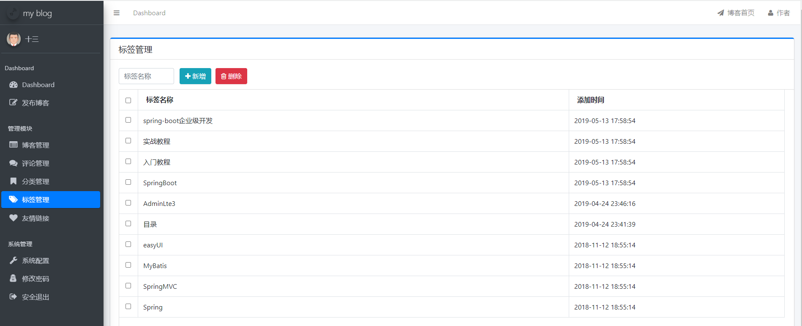

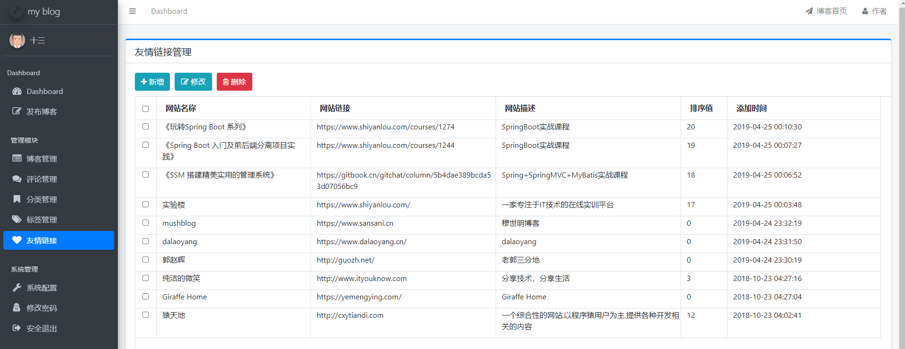

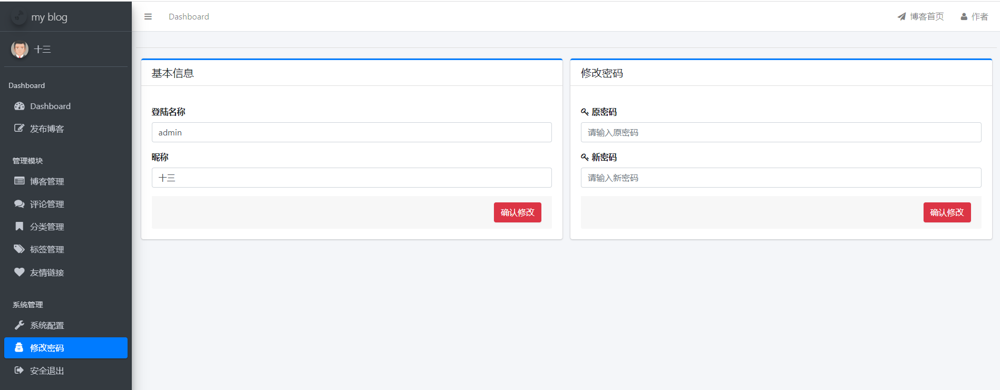

## 五、浏览地址

登录地址  http://localhost:8092/

账号密码   admin  123456

## 六、安装教程

1. 使用Navicat或者其它工具，在mysql中创建对应名称的数据库，并导入项目的sql文件；
2. 使用IDEA/Eclipse/MyEclipse导入项目，Eclipse/MyEclipse导入时，若为maven项目请选择maven;
   若为maven项目，导入成功后请执行maven clean;maven install命令，然后运行；
3. 修改application.yml 里面的数据库配置配置
4. 启动项目后端项目 
5. 访问  http://localhost:8092/

**需要完整代码可以加qq   931708230 或者加微信   ynwwxid**
